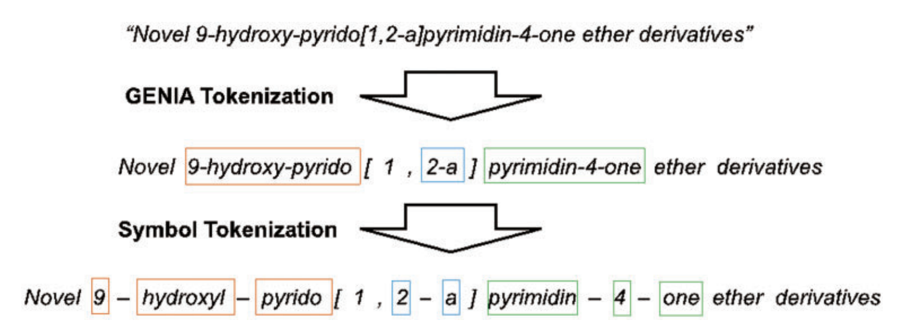
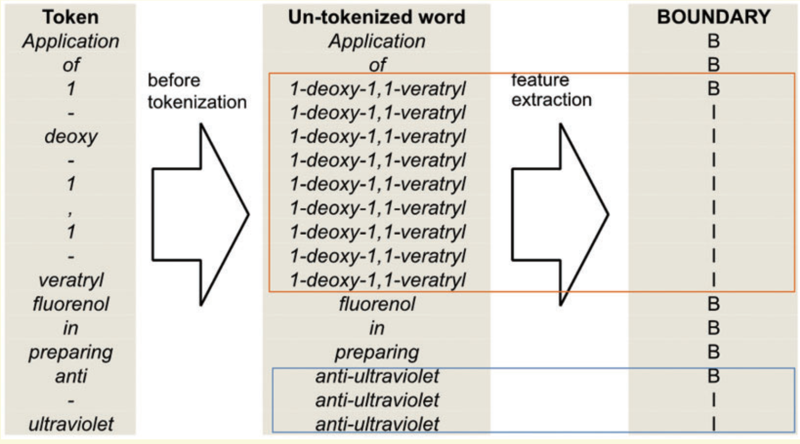

# BioCreative 任务语料 预处理

    预处理
     1、从.eval和.in文件中获取数据和标签文件，初步过滤
     2、对句子中所有的实体做上标记（在实体前后加入特定标签[BEGIN-/-INSIDE]）
     3、利用GENIA tagger工具对标记过的语料进行预处理，得到 test.out 文件
     4、根据预处理语料的标记（#@）获取BIO标签，写入test.out 文件

 问题：
 暂时无法解决嵌套实体的BIO标记

## How to use GENIA tagger：

  Prepare a text file containing one sentence per line, then

  $ ./geniatagger  segmentData/test_flag.txt > segmentData/test.genia

## 附录

### PubMed 数据下载和预处理

- Download a selection of abstracts relevant to the comorbidity topic from PubMed in XML format
- Extract title and abstract texts using the tool available from https://github.com/spyysalo/pubmed
- Sentence-split using the tool available from https://github.com/spyysalo/pubmed 
- Employ the  GENIA Tagger to tokenize sentences into full tokens. Then, we run a sub-tokenization module ( simple heuristics ) used in our previous work (2) to further divide the tokens into sub-tokens. As a result, there are fewer unseen tokens after extra tokenization. （ 参考 ）
    * 利用标点符号作为分隔符（e.g. 连字符）进一步切分
    * 所有的数字被归一化为“1”
- Add lemma, part of speech, chunk and named entity recognition for biomedical text using GENIA Tagger
- Then we generate the full-token boundary feature. (匹配BIO标记)
    * First, we use spaces as the delimiter to segment a sentence into a sequence of words. 
    * Then, we map each token to a word segmented in the previous step. However, if the token is a punctuation mark or the prefix or suffix of the word containing it, the token is mapped to itself. 
    * Afterwards, we apply our full-token orthographical patterns to match the original word. 
- 后处理（Refinement）
    * 收集所有识别出的实体提及（chemical mentions），然后利用最大子长匹配算法来检查是否实体提及有丢失词。
    * 如果词典匹配的实体提及与先前识别出的实体提及重叠，那么后者（匹配的实体提及）将被确定为化学名称。

